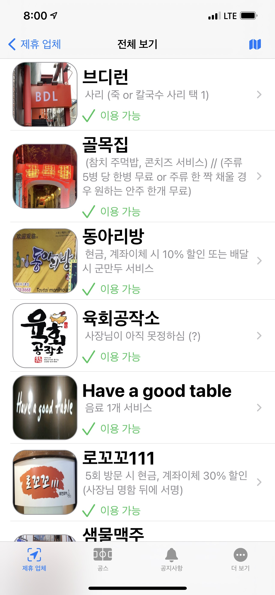
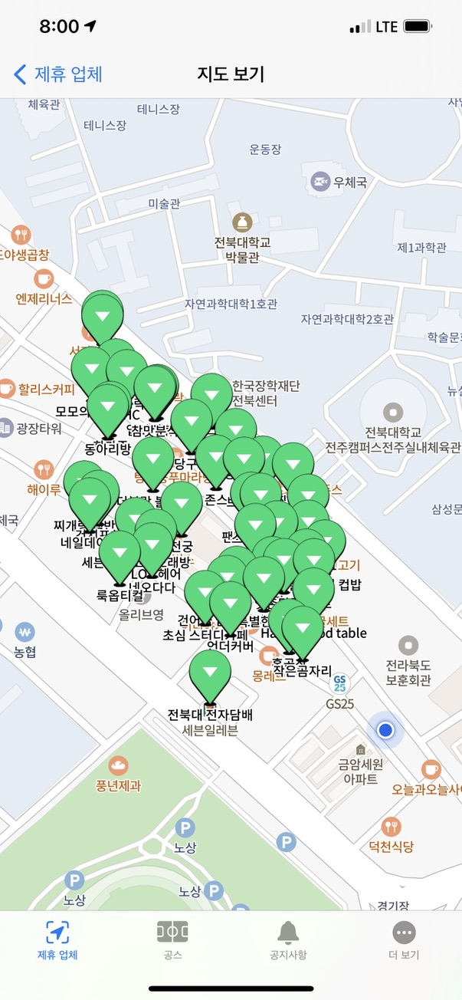
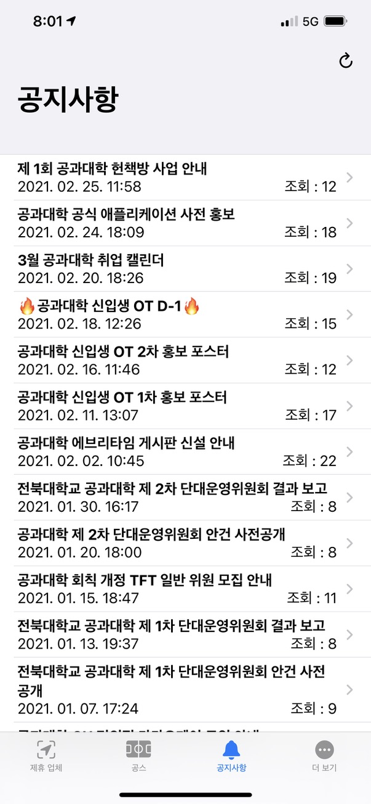
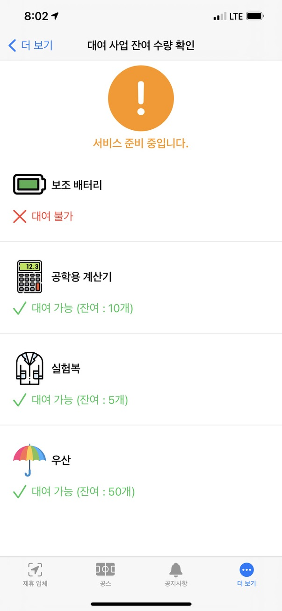
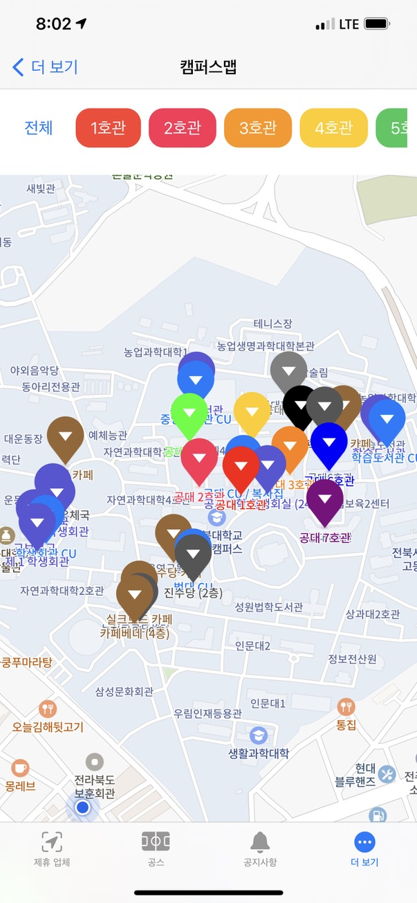
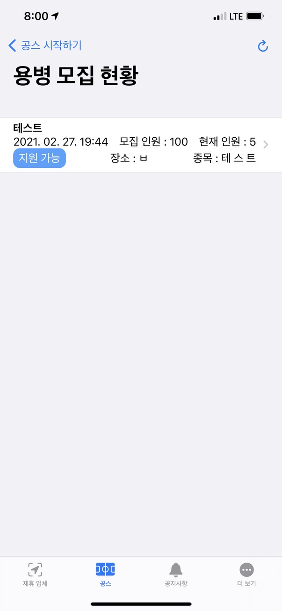
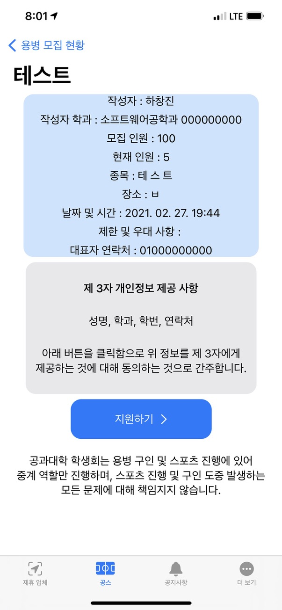
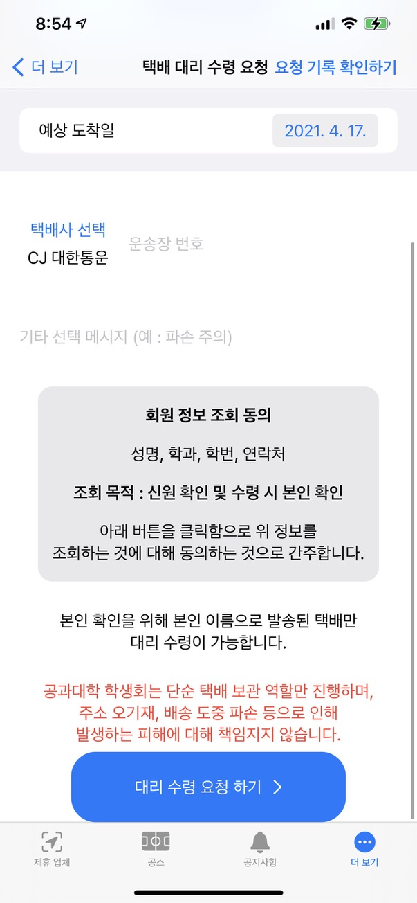

 
# JBNU COE 
### An official mobile application of College of Engineering, Jeonbuk National University Student Council. get notice and welfare for fastest 
ⓒ 2021-2024. Changjin Ha. All Rights Reserved.  

> Note: These are screenshots of iOS software. Some UIs may vary somewhat depending on the OS. 

## Features 
#### Associate Stores 
> List of affiliates, location, benefits, representative menus, and everything from one touch to the phone. 

 

#### Notice 
> The quickest way to check student council announcements 

 

#### Remaining quantity of rental items 
> Even if you don't come to the student council room, check the items and rental records at a glance in real time 

 

#### Campus Map 
> How to forget how to get lost 

 

#### Sports mercenary system 
> Looking for someone to work out with anytime, anywhere 

 

#### HandWriting 
> A peek at the successful candidate's secret 

 

#### Delivery agent receipt 
> Delivery that is difficult to receive in person, now register through the app and visit when you have time 

 

#### Real-time pledge fulfillment rate 
> Student council's promise fulfillment rate in real time 

 

#### Feedback Hub 
> From school facilities to apps, now make it with your ideas 

 

 * Required Android 8.0 or up.  
 * 500MB or higher storage required for install application.

